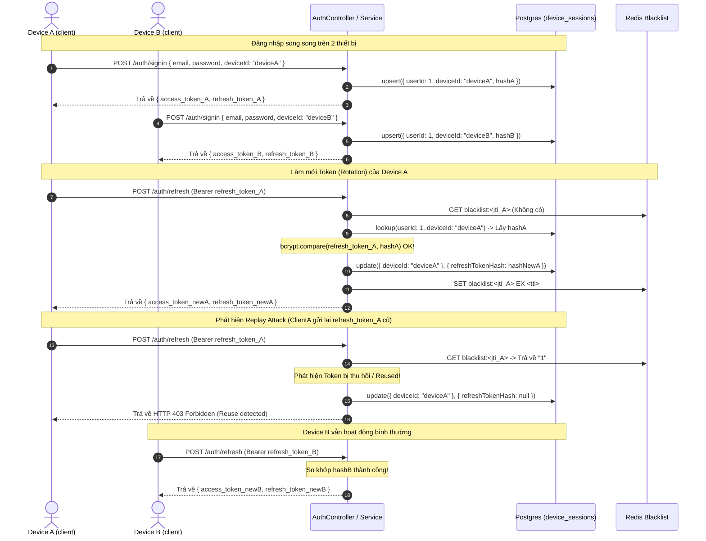

# NestJS Employee JWT Authentication, Multi-Device Sessions & Refresh Token Rotation

Hệ thống quản lý xác thực người dùng sử dụng JSON Web Token (JWT) với mô hình **Multi-Device Sessions** (Một User đăng nhập được trên nhiều thiết bị song song). Hệ thống tích hợp cơ chế **Refresh Token Rotation (Xoay vòng)** và **Logout theo từng thiết bị** độc lập mà không ảnh hưởng đến phiên làm việc trên các thiết bị khác của cùng một người dùng.

Dịch vụ chạy trên nền tảng NestJS, Passport, TypeORM, PostgreSQL 16 và Redis 7 thông qua Docker Compose.

---

## 1. Schema & Cấu trúc Database

Bảng `device_sessions` quản lý các phiên làm việc của từng thiết bị.

* **Thực thể (`DeviceSession` Entity):** [device-session.entity.ts](file:///d:/Nghia-project/escape-beta/employee-jwt-auth/src/modules/auth/device-session.entity.ts)
* **Các cột chính:**
  * `id`: `uuid` (Primary Key).
  * `userId`: `integer` (Foreign Key tham chiếu tới bảng `users`).
  * `deviceId`: `varchar` (Mã định danh thiết bị độc lập do client tự sinh).
  * `refreshTokenHash`: `text` (Mã băm bcrypt của Refresh Token hiện tại, giá trị là `null` nếu đã Logout).
  * `createdAt` / `updatedAt`: `timestamp`.
* **Ràng buộc duy nhất (Unique Constraint):** `@Unique(['userId', 'deviceId'])` đảm bảo mỗi cặp người dùng và thiết bị chỉ tồn tại duy nhất một phiên hoạt động tại bất kỳ thời điểm nào.

---

## 2. Các luồng xử lý chính & Tracking Code

### A. Luồng Đăng nhập (`POST /auth/signin`)
Client gửi lên request body gồm: `{ email, password, deviceId }`.
1. **Xác thực thông tin tài khoản**: [auth.service.ts:L66-L77](file:///d:/Nghia-project/escape-beta/employee-jwt-auth/src/modules/auth/auth.service.ts#L66-L77) tìm User và đối sánh password qua bcrypt.
2. **Ký phát Token**: 
   * **Access Token** chứa payload `{ sub, email }`, hạn 15 phút, kèm unique `jwtid` (jti) ([L80-L87](file:///d:/Nghia-project/escape-beta/employee-jwt-auth/src/modules/auth/auth.service.ts#L80-L87)).
   * **Refresh Token** chứa payload `{ sub, deviceId }`, hạn 7 ngày, kèm unique `jwtid` (jti) ([L90-L97](file:///d:/Nghia-project/escape-beta/employee-jwt-auth/src/modules/auth/auth.service.ts#L90-L97)).
3. **Mã hóa và Upsert**: Băm Refresh Token mới ([L99](file:///d:/Nghia-project/escape-beta/employee-jwt-auth/src/modules/auth/auth.service.ts#L99)) và gọi `deviceSessionRepository.upsert` để lưu vào DB theo cặp khóa `['userId', 'deviceId']` ([L102-L110](file:///d:/Nghia-project/escape-beta/employee-jwt-auth/src/modules/auth/auth.service.ts#L102-L110)).

---

### B. Luồng Làm mới Token (`POST /auth/refresh`)
Client gửi Bearer Refresh Token ở Header (`Authorization: Bearer <token>`).
1. **Verify Signature**: [refresh-token.strategy.ts:L22-L27](file:///d:/Nghia-project/escape-beta/employee-jwt-auth/src/modules/auth/refresh-token.strategy.ts#L22-L27) tự động verify chữ ký số và hạn dùng dựa trên `JWT_REFRESH_SECRET`.
2. **Blacklist Check**: [refresh-token.strategy.ts:L39-L44](file:///d:/Nghia-project/escape-beta/employee-jwt-auth/src/modules/auth/refresh-token.strategy.ts#L39-L44) kiểm tra xem token JTI có nằm trong Redis blacklist không.
3. **Đối chiếu DB & Phân loại mã lỗi**:
   * **Lỗi 401 Unauthorized (Đã bị thu hồi / Logout)**: Nếu `refreshTokenHash` trong DB của session này đang là `null` ([refresh-token.strategy.ts:L51-L54](file:///d:/Nghia-project/escape-beta/employee-jwt-auth/src/modules/auth/refresh-token.strategy.ts#L51-L54)).
   * **Lỗi 403 Forbidden (Phát hiện Replay Attack / Reuse)**: Nếu hash tồn tại nhưng so sánh bcrypt không khớp ([refresh-token.strategy.ts:L56-L66](file:///d:/Nghia-project/escape-beta/employee-jwt-auth/src/modules/auth/refresh-token.strategy.ts#L56-L66)). Đồng thời, hệ thống lập tức thu hồi toàn bộ session này (set `refreshTokenHash = null`) để tự động ngắt kết nối thiết bị đáng ngờ.
4. **Rotation**: Nếu hợp lệ, hệ thống phát cặp token mới, cập nhật hash mới vào DB ([auth.service.ts:L163-L166](file:///d:/Nghia-project/escape-beta/employee-jwt-auth/src/modules/auth/auth.service.ts#L163-L166)) và đưa JTI của Refresh Token cũ vào Redis blacklist ([auth.service.ts:L169-L174](file:///d:/Nghia-project/escape-beta/employee-jwt-auth/src/modules/auth/auth.service.ts#L169-L174)).

---

### C. Luồng Đăng xuất thiết bị cụ thể (`POST /auth/logout`)
Client gửi Bearer Access Token ở Header và request body `{ deviceId }`.
1. **Trích xuất thông tin**: [auth.controller.ts:L31-L33](file:///d:/Nghia-project/escape-beta/employee-jwt-auth/src/modules/auth/auth.controller.ts#L31-L33) xác thực người dùng qua `JwtAuthGuard` và gọi hàm `logout`.
2. **Hủy bỏ phiên độc lập**: [auth.service.ts:L186-L189](file:///d:/Nghia-project/escape-beta/employee-jwt-auth/src/modules/auth/auth.service.ts#L186-L189) cập nhật `refreshTokenHash = null` cho cặp `(userId, deviceId)`. 
3. **Blacklist Access Token**: Đưa JTI của Access Token vừa đăng xuất vào Redis Blacklist với TTL động ([auth.service.ts:L192-L203](file:///d:/Nghia-project/escape-beta/employee-jwt-auth/src/modules/auth/auth.service.ts#L192-L203)).

---

## 3. Sơ đồ Mermaid luồng Multi-Device Refresh Token Rotation & Revocation



---

## 4. Cách chạy và Test cơ chế này

1. **Khởi động Containers (Postgres + Redis)**:
   ```bash
   docker compose up -d
   ```
2. **Biên dịch và chạy thử NestJS**:
   ```bash
   npm run start:dev
   ```
3. **Chạy các bài kiểm thử tích hợp (E2E Tests)**:
   ```bash
   npm run test:e2e
   ```
   Bộ test e2e trong `test/auth.e2e-spec.ts` sẽ giả lập đăng nhập đồng thời 2 thiết bị khác nhau, kiểm tra độc lập các token và đảm bảo rằng việc hủy phiên (logout) trên một thiết bị không làm ảnh hưởng hay ngắt quãng phiên đăng nhập của các thiết bị khác.
